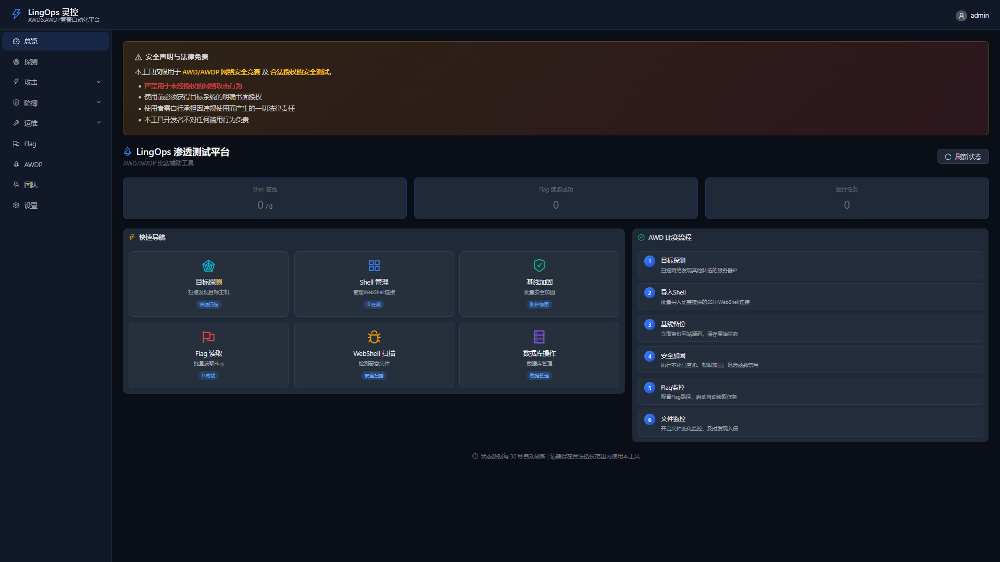
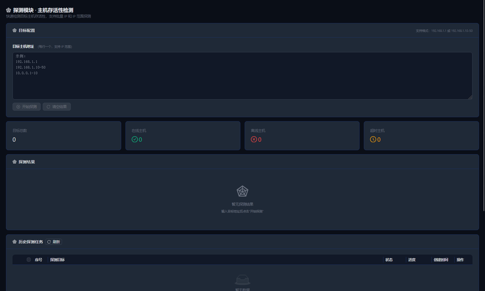
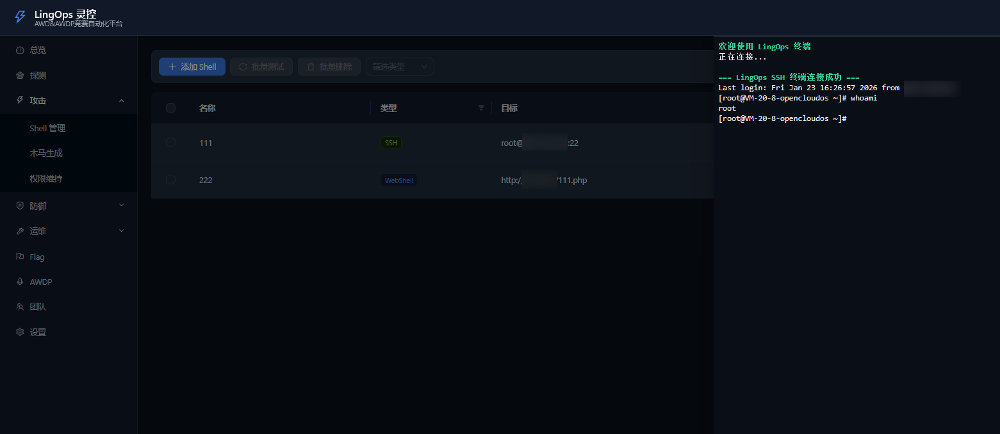
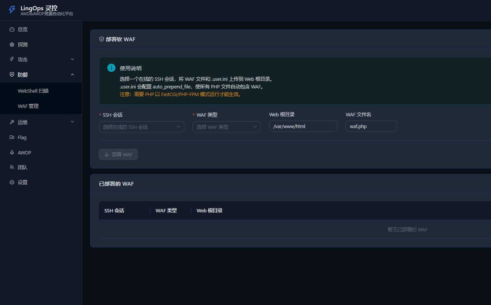
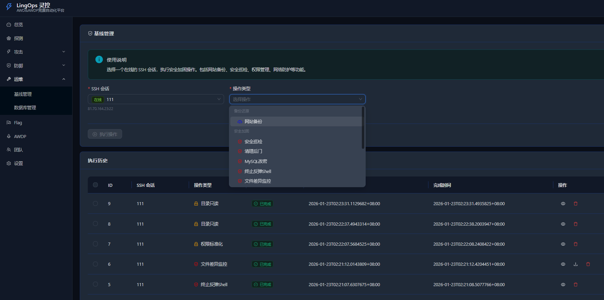
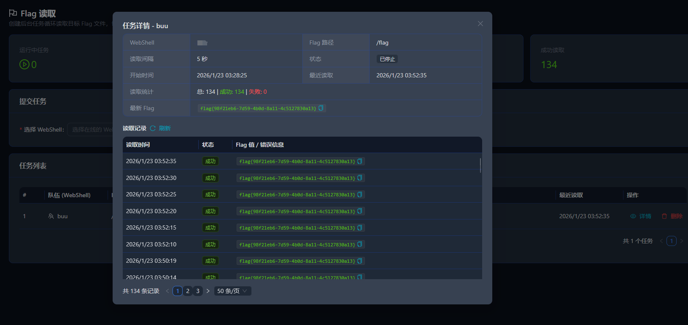

# LingOps（灵控）- AWD/AWDP 竞赛自动化平台

  
  
  
  

## 📖 简介

LingOps（灵控） 是一个专为 AWD/AWDP 攻防竞赛设计的竞赛自动化平台，提供 IP探测、WebShell 管理、SSH 终端、基线加固、Flag 读取等核心功能，帮助参赛选手在比赛中高效管理多个目标。

## ✨ 核心功能

### 🔍 目标探测
- **网络扫描** - 快速检测目标主机存活性，支持批量 IP 和 IP 范围探测

### ⚡ 攻击模块
- **Shell 管理** - WebShell/SSH 连接管理，支持虚拟终端、文件管理
- **木马生成** - 生成各种类型的 WebShell 木马
- **权限维持** - 通过不死马、内存马维持已获取的权限

### 🛡️ 防御模块
- **WebShell 扫描** - 基于规则引擎的 WebShell 检测，支持 ZIP 上传和远程扫描
- **WAF 管理** - WAF 规则配置与部署

### 🛠️ 运维模块
- **基线管理** - 网站备份、安全巡检、权限标准化、PHP 安全配置、后门清理、文件差异监控、反弹 Shell 终止、端口封禁、SSH密码修改、Mysql密码修改
- **数据库管理** - MySQL 连接管理、SQL 执行、数据库备份恢复

### 🚩 Flag 读取
- **后台任务模式** - 切换页面不中断

- **定时读取** - 设置间隔自动循环读取

- **历史记录** - 查看所有读取记录和时间

### ⏳ Flag 自动提交（待开发）
> 自动化提交 Flag 的系统，用于竞赛或演练场景。

### ⏳ AWDP 专项（待开发）
> 针对 Attack-Defense 比赛（AWDP）的专项工具集。

### ⏳ 其他功能（待开发）
> 其他辅助工具或扩展功能，具体内容待定。

## 🚀 快速开始

### 1.发行版本下载
我们提供预编译的二进制包，您可以从 [GitHub Releases](https://github.com/zhanglinglingc/lingops/releases) 页面下载最新版本。

**当前最新版本：v0.1.0**

| 操作系统 | 版本 | 下载 | 描述 |
| :--- | :--- | :--- | :--- |
| **Windows** | v0.1.0 | [LingOps_v0.1.0_win64.zip](https://github.com/zhanglinglingc/lingops/releases/download/v0.1.0/LingOps_v0.1.0_win64.zip) | 64位Windows可执行程序 |
| **Linux** | v0.1.0 | [LingOps_v0.1.0_linux_amd64.zip](https://github.com/zhanglinglingc/lingops/releases/download/v0.1.0/LingOps_v0.1.0_linux_amd64.zip) | 64位Linux可执行程序 |
| **macOS** | - | `开发中，敬请期待` | Apple Silicon (ARM64) 与 Intel 版本 |

> **注意**：如果您需要更早的版本或查看更新日志，请访问完整的 [Releases 页面](https://github.com/zhanglinglingc/lingops/releases)。

### 2. 启动可执行文件

### 3. 访问
打开浏览器访问 `http://127.0.0.1:8080`

**默认账号密码：**
- 用户名：`admin`

- 密码：`admin123`

  

## 🔒 部分功能预览

### ✨ 首页

### 🔍 目标探测

### ⚡ shell管理

### 🛡️ WAF管理

### 🛠️ 基线管理

### 🚩 Flag 读取

## 🔒 安全说明

⚠️ **本工具仅供授权的安全测试和 CTF 比赛使用！**

- 请勿用于未授权的系统
- 请勿用于非法活动
- 使用者需自行承担法律责任

